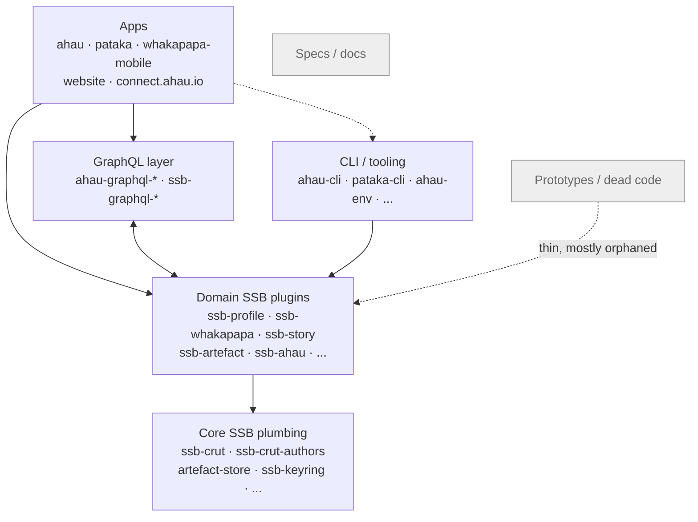

# Āhau System Architecture

This document maps how the 61 repositories in this org fit together. It was built by
reading every repo's `package.json` from its default branch (no full checkouts needed
for that pass), matching npm package names against each other to build a real
dependency graph, then checking out and reading representative repos per cluster to
verify what they actually do. It's written for someone who knows general software
engineering but has never touched Secure Scuttlebutt (SSB) or this codebase before.

See the [Appendix](#appendix-how-this-map-was-built-how-to-regenerate-it) for how to
regenerate or extend this analysis.

---

## 1. What is Secure Scuttlebutt, in this codebase's terms

SSB is a peer-to-peer protocol with no servers and no central database. The concepts
that actually matter for reading this code:

- **Feed** — each person/device identity is an append-only, cryptographically signed
  log of messages (like a personal git log nobody else can rewrite). Your `feedId`
  is your public key.
- **Message** — a signed, immutable JSON entry appended to a feed. Most "records"
  in this system (a profile, a whakapapa relationship, a story) are not single
  messages — they're a **root message plus a chain of update messages**, reduced
  down to current state on read. This pattern is called a **tangle**, and the
  library that implements create/read/update/tombstone on top of tangles is
  `ssb-crut` (see [§3](#3-core-ssb-plumbing)) — CRUT = Create, Read, Update,
  Tombstone (there's no hard delete on an append-only log).
- **Replication / gossip** — peers connect (locally on a LAN, or via a known
  "pub"/always-on peer) and exchange messages to sync each other's feeds. There's
  no server pushing data; every peer pulls what it's missing.
- **Private groups ("tribes")** — messages can be encrypted so only members of a
  group can read them (`ssb-tribes`, referenced as a dependency but not itself
  one of the 61 repos — it's an upstream SSB library, not something this org owns).
  `recps` (recipients) on a message controls this.
- **Blobs** — binary content (photos, audio, video, files) is content-addressed
  (hash-named) and stored/replicated separately from the message log. This system
  actually has **two blob storage mechanisms** in play — see
  [§3](#3-core-ssb-plumbing) and [§4](#4-domain-ssb-plugins).
- **secret-stack** — the plugin-loading framework used to assemble an SSB server:
  you `.use()` a chain of plugins (db, replication, blobs, and this org's own
  domain plugins) onto a base stack, and it exposes their combined API as one
  object (conventionally called `ssb` or `server`).

Everything in this system is: a secret-stack server with plugins loaded onto it,
talking to other identical servers over SSB replication, with a GraphQL layer
translating that into something a web/mobile UI can query.

---

## 2. System at a glance

**Āhau** ("time", also the product name) is an app for recording and sharing
**whakapapa** — Māori genealogies / family trees / traditional knowledge — peer to
peer, so that no single company or server holds the data. **Pātaka** ("storehouse")
is a sibling always-on peer that backs up and relays encrypted data for people who
are offline. Both are one product family built from the same shared libraries.

The 61 repos split into 7 clusters:

| Cluster | # repos | Role |
|---|---|---|
| [Apps](#2-system-at-a-glance) | 5 | The actual products: desktop/mobile Āhau, Pātaka, marketing site |
| [Core SSB plumbing](#3-core-ssb-plumbing) | 7 | Generic, content-agnostic building blocks (tangle CRUD, blob storage, key handling) |
| [Domain SSB plugins](#4-domain-ssb-plugins) | 11 | secret-stack plugins for Āhau's specific record types (profiles, whakapapa links, stories, artefacts...) |
| [GraphQL layer](#5-graphql-layer) | 15 | Turns the plugins' callback APIs into a GraphQL schema the UI can query |
| [CLI / tooling utilities](#6-cli-tooling-utilities) | 7 | Command-line runners and shared helpers, not shipped in the apps |
| [Prototypes / dead code](#7-prototypes-dead-code) | 8 | Experiments, spikes, one named literally "broken" |
| [Specs / docs](#8-specs-docs) | 8 | Design documents, no runnable code |

### Cluster-level dependency diagram



The `GQL <--> Plugins` double arrow is real, not a mistake: `ssb-ahau` (a domain
plugin — it's the app's "composition root") pulls in nearly the entire GraphQL
layer, while each `@ssb-graphql/X` package pulls in its matching `ssb-X` domain
plugin for logic/types. There's no single-package circular dependency, but the two
clusters reference each other constantly at the cluster level.

**The architecture is layered, roughly:**

```
Apps  →  GraphQL layer  →  Domain SSB plugins  →  Core SSB plumbing
Apps  →  CLI/tooling     →  Domain SSB plugins
```

Nothing depends on Apps — they're pure leaves, as expected for products. Nothing in
Core plumbing depends back up the stack — it's genuinely generic.

### How active is each part, really?

Every table below has an **activity** column, computed from the org's archived
GitLab merge-request and issue history (1,757 MRs, 84 issues, 2019–2026 — see the
[Appendix](#appendix-how-this-map-was-built-how-to-regenerate-it) for method and a
data-quality caveat worth knowing about). The short version: **only 5 of 61 repos
have had any recorded activity in the last 12 months** — `ahau/ahau`, `ahau/pataka`,
`ssb-ahau`, `ssb-graphql-whakapapa`, and `docs.ahau.io`. 37 repos are **dormant**
(real history, nothing recent) and 19 have **no recorded MR/issue activity at all**.
This matches "maintenance mode" concretely rather than just by assertion — but a
handful of specific numbers below are genuinely worth knowing rather than assuming.

---

## 3. Core SSB plumbing

Generic building blocks with no knowledge of whakapapa, profiles, or any
Āhau-specific concept. These would be reusable in a completely different SSB app.

| repo | npm name | in-deg | out-deg | description | activity | last activity | MRs | issues |
|---|---|---|---|---|---|---|---|---|
| `ahau/lib/ssb-crut` | `ssb-crut` | 9 | 0 | easy CRUT methods for secure scuttlebutt | dormant | 2023-12-12 | 41 | 9 |
| `ahau/lib/ssb-crut-authors` | `ssb-crut-authors` | 5 | 1 | ssb-crut but with author permissions baked in! | dormant | 2024-08-06 | 10 | 2 |
| `ahau/lib/artefact-store` | `artefact-store` | 2 | 0 | a hyperdrive based blob store which supports encryption, streaming, ... | dormant | 2024-02-18 | 28 | 1 |
| `ahau/lib/ssb-keyring` | `ssb-keyring` | 1 | 0 | (no description in package.json) | dormant | 2023-10-16 | 32 | 3 |
| `ahau/lib/ssb-migrate` | `ssb-migrate` | 1 | 0 | handle database migrations for scuttlebutt | dormant | 2022-05-13 | 3 | 0 |
| `ahau/lib/artefact-server` | `artefact-server` | 1 | 1 | makes artefact-store available over http | dormant | 2024-02-18 | 6 | 0 |
| `ahau/lib/ssb-split-publish` | `ssb-split-publish` | 0 | 0 | side-step the scuttlebutt message-size limit by splitting content over multiple messages | no-activity | — | 0 | 0 |

**in-deg** = how many of the other 60 repos depend on it (a proxy for "how load-bearing
is this"). **out-deg** = how many of the other 60 it depends on. **activity** = computed
from real MR/issue history — see [§2](#how-active-is-each-part-really) and the Appendix.

### Deep dive: `ssb-crut` — the record framework everything else is built on

`ssb-crut` is the single most foundational library in this codebase (9 direct
internal dependents, and indirectly underneath almost everything, since
`ssb-profile`, `ssb-settings`, `ssb-story`, `ssb-whakapapa`, `ssb-submissions`,
and `ssb-tribes-registration` are all thin wrappers around it).

What it does: given a `spec` describing a record type (e.g. `{ type: 'gathering',
props: { title: Overwrite(), attendees: SimpleSet() } }`), it mints
`.create()`/`.read()`/`.update()`/`.tombstone()`/`.list()` methods for that record
type, backed by SSB tangles. The "props" use small conflict-resolution strategies
(from a sibling `@tangle/*` package family, upstream — not one of these 61 repos)
like `Overwrite` (last write wins) or `SimpleSet` (mergeable add/remove set), so
that if two peers edit the same record while offline, `.read()` can automatically
merge or at least surface the conflict (`conflictFields`) rather than silently
losing data. `recps` on create makes a record private to an SSB group.

This is the piece to understand first: once you get that "a whakapapa relationship"
and "a profile" and "a story" are all just `ssb-crut` records with different specs,
most of the domain-plugins cluster reads as boilerplate around this one idea.

`ssb-crut-authors` is `ssb-crut` plus baked-in permission logic (only the original
author(s) can update), used by the plugins that need author-locked records.

### Deep dive: blob storage — two separate systems, both live

There are **two independent blob-storage stacks** in this codebase, which is worth
flagging explicitly since it's not obvious from repo names alone:

1. `artefact-store` → `artefact-server` → `ssb-hyper-blobs` (a Domain SSB plugin,
   see §4): a **Hyperdrive/DAT-based** store, purpose-built for Āhau, supporting
   encryption and streaming. `ssb-hyper-blobs` is the secret-stack plugin that
   wires an `artefact-server` instance into an SSB server and serves blobs over
   local HTTP.
2. Standard upstream SSB blob plugins (`ssb-blobs`, `ssb-serve-blobs`) — visible as
   *external* dependencies in `ahau`'s `desktop/package.json` and
   `ssb-graphql-main`'s requirements, but not repos this org owns.

Both are wired into the flagship `ahau` app simultaneously (see §2's desktop
`package.json` dependency list). This dual-stack is a real architectural quirk
worth asking the original team about if you ever get the chance — it's not
something inferrable from the code alone why both exist.

---

## 4. Domain SSB plugins

secret-stack plugins that add Āhau/Pātaka-specific record types on top of the core
plumbing. Each one is `.use()`-d directly into a secret-stack server; several are
just an `ssb-crut` spec plus a thin API layer.

| repo | npm name | in-deg | out-deg | description | activity | last activity | MRs | issues |
|---|---|---|---|---|---|---|---|---|
| `ahau/lib/ssb-plugins/ssb-profile` | `ssb-profile` | 22 | 2 | reading/writing "profile threads" — people, communities, pātaka | dormant | 2024-04-10 | 75 | 2 |
| `ahau/lib/ssb-plugins/ssb-settings` | `ssb-settings` | 16 | 2 | settings records | dormant | 2023-12-11 | 5 | 0 |
| `ahau/lib/ssb-plugins/ssb-whakapapa` | `ssb-whakapapa` | 12 | 2 | relationship links between profiles (the actual family-tree edges) | dormant | 2023-12-11 | 24 | 1 |
| `ahau/lib/ssb-plugins/ssb-story` | `ssb-story` | 10 | 1 | stories attached to profiles | dormant | 2024-04-09 | 13 | 1 |
| `ahau/lib/ssb-plugins/ssb-artefact` | `ssb-artefact` | 10 | 1 | artefacts (media/files) attached to profiles | dormant | 2023-12-11 | 11 | 2 |
| `ahau/lib/ssb-plugins/ssb-submissions` | `ssb-submissions` | 6 | 3 | submissions (e.g. web-form intake) into a tribe | dormant | 2024-02-01 | 23 | 1 |
| `ahau/lib/ssb-plugins/ssb-hyper-blobs` | `ssb-hyper-blobs` | 6 | 2 | wires artefact-store's blob storage into a secret-stack server, over local HTTP | dormant | 2024-04-09 | 14 | 1 |
| `ahau/lib/ssb-plugins/ssb-tribes-registration` | `ssb-tribes-registration` | 5 | 1 | applying to join a private group | dormant | 2024-04-15 | 3 | 0 |
| `ahau/lib/ssb-plugins/ssb-pataka` | `ssb-pataka` | 3 | 18 | runs Pātaka's whole API surface (see below) | dormant | 2025-04-03 | 20 | 1 |
| `ahau/lib/ssb-plugins/ssb-ahau` | `ssb-ahau` | 2 | 22 | runs Āhau desktop's whole API surface (see below) | **active** | 2026-07-28 | 81 | 0 |
| `ahau/lib/ssb-plugins/ssb-atala-prism` | `ssb-atala-prism` | 2 | 8 | integrates the Atala PRISM decentralized-identity SDK (verifiable credentials) | dormant | 2024-06-19 | 13 | 2 |

### Deep dive: `ssb-profile` — the most central package in the whole system

Highest in-degree of any of the 61 repos (22). It manages "profile" records for
**people, communities, and pātaka** — and notably these come in **four privacy
tiers** for a person: `public` (name + avatar only, unencrypted), `group`
(full details, encrypted to a family/community group), `admin` (same as group but
also postable-to by admins — e.g. someone submitting info about a relative), and
`source` (everything, encrypted to your own personal group — private notes to
self). Updates to `source` propagate out to the other tiers (documented with a
Mermaid diagram in its own README). It also owns `link/*` records connecting a
`feedId` (device identity) to a profile, and `profile-profile/admin` links.

This is the plugin to read first when learning the domain layer, since basically
every other domain plugin either extends it (custom fields, admin links) or
attaches records to the profiles it manages (`ssb-whakapapa` links two profiles;
`ssb-story`/`ssb-artefact` attach content to a profile).

### Deep dive: `ssb-whakapapa` — the actual genealogy graph

Manages parent/child and partner relationships between profiles, plus "views" — a
saved perspective on the graph (e.g. "descendants of this ancestor, mode=down,
excluding whangai/adopted"). This is the plugin that turns a pile of individual
profile records into an actual navigable family tree.

### `ssb-ahau` and `ssb-pataka` are composition-root plugins, not content plugins

These two stand out from the rest of the cluster: instead of managing a record
type, they **bundle and federate the entire GraphQL layer** for their respective
app (`ssb-ahau` has out-degree 22, `ssb-pataka` has out-degree 18 — by far the
highest in this cluster) plus a bit of app-specific glue (e.g. `ssb-ahau` copies
your private profile into a group when you join it; runs DB migrations on
startup). This is why `ssb-ahau`'s own in-degree is only 2 — almost nothing
depends on it, because it's the top of its own dependency tree, sitting directly
under the `ahau` app itself. If you're trying to find "where does the Āhau
GraphQL API actually get assembled," this is the file/repo, not
`ahau-graphql-server` (which is generic Apollo plumbing, see §5).

`ssb-ahau` is also the **most recently active library-level repo in the whole
system** (81 MRs, last touched 2026-07-28 — more recent than anything except
`ahau/ahau` itself). Its real MR history reads as active integration work, not
churn: `install ssb-atala-prism` (2023-11-07) → `Allow Verified Credentials -
Update Modules` (2023-11-29) → `add issuesVerifiedCredentials to community
public profile` (2023-12-05) → `Upgrade to db2` (2023-12-13) → `Use new
artefact modules` (2024-02-16). That sequence is the Atala PRISM identity work
(§4 below, §9) actually landing in the app, in order.

### `ssb-atala-prism` — an in-progress identity experiment

Integrates IOHK's **Atala PRISM** SDK (decentralized identifiers / verifiable
credentials — a different, blockchain-anchored identity system, distinct from
SSB's own feed-based identity) so that a "kaitiaki" (guardian/admin) can issue a
verifiable credential to a tribe member. It's wired into the flagship `ahau`
app's desktop and mobile builds already (both list it as a real dependency), but
its existence alongside `broken-atala-demo`, `ahau-atala-prism-webhook`, and
`atala-prism-wallet-sdk-ts` in the Prototypes cluster (§7), plus a still-open
"Digital Identity Design" question doc in Specs (§8), suggests this integration
was **mid-flight, exploratory work** rather than a finished feature — treat it as
the area most likely to need real SSB/PRISM expertise to safely continue or rip
out. This is now evidence-backed, not just inferred: `ssb-atala-prism` itself has
been **dormant since 2024-06-19** (13 MRs total) — real work happened, then
stopped, over a year before this document was written. Its sibling
`broken-atala-demo` (§7, §9) never had *any* MR/issue activity at all, which is
the clearest signal yet of the two: one is a stalled real feature, the other
never left the experiment stage.

---

## 5. GraphQL layer

Turns the domain plugins' Node callback APIs into a GraphQL schema, federated
together and served over Apollo. This is purely a translation/composition layer —
none of these packages talk to SSB replication directly, they all sit on top of a
domain plugin from §4.

| repo | npm name | in-deg | out-deg | description | activity | last activity | MRs | issues |
|---|---|---|---|---|---|---|---|---|
| `ahau/lib/graphql/ahau-graphql-client` | `ahau-graphql-client` | 17 | 0 | Apollo GraphQL client, used by every UI | no-activity | — | 0 | 0 |
| `ahau/lib/graphql/ahau-graphql-server` | `ahau-graphql-server` | 15 | 5 | generic Apollo server bootstrap (CORS, port, federation glue) | dormant | 2024-03-21 | 1 | 0 |
| `ahau/lib/graphql/ssb-graphql-main` | `@ssb-graphql/main` | 14 | 7 | CurrentIdentity, file-upload, Date scalar — cross-cutting primitives | dormant | 2024-04-10 | 26 | 0 |
| `ahau/lib/graphql/ssb-graphql-profile` | `@ssb-graphql/profile` | 11 | 7 | resolvers for `ssb-profile` | dormant | 2024-04-10 | 93 | 1 |
| `ahau/lib/graphql/ssb-graphql-whakapapa` | `@ssb-graphql/whakapapa` | 5 | 13 | resolvers for `ssb-whakapapa` | **active** | 2026-04-24 | 46 | 3 |
| `ahau/lib/graphql/ssb-graphql-tribes` | `@ssb-graphql/tribes` | 4 | 10 | resolvers for private groups | dormant | 2024-04-16 | 17 | 0 |
| `ahau/lib/graphql/ssb-graphql-story` | `@ssb-graphql/story` | 4 | 6 | resolvers for `ssb-story` | dormant | 2024-04-10 | 17 | 0 |
| `ahau/lib/graphql/ssb-graphql-artefact` | `@ssb-graphql/artefact` | 4 | 6 | resolvers for `ssb-artefact` | dormant | 2024-04-10 | 16 | 0 |
| `ahau/lib/graphql/ssb-graphql-submissions` | `@ssb-graphql/submissions` | 2 | 15 | resolvers for `ssb-submissions` | dormant | 2024-04-16 | 33 | 3 |
| `ahau/lib/graphql/ssb-graphql-invite` | `@ssb-graphql/invite` | 2 | 5 | invite-code resolvers | dormant | 2024-04-10 | 7 | 0 |
| `ahau/lib/graphql/graphql-custom-field` | `graphql-custom-field` | 2 | 2 | custom multi-type GraphQL scalar | dormant | 2023-12-13 | 4 | 0 |
| `ahau/lib/graphql/ssb-graphql-settings` | `@ssb-graphql/settings` | 1 | 3 | resolvers for `ssb-settings` | dormant | 2024-04-10 | 6 | 0 |
| `ahau/lib/graphql/ssb-graphql-pataka` | `@ssb-graphql/pataka` | 1 | 6 | resolvers specific to Pātaka | dormant | 2024-02-04 | 4 | 0 |
| `ahau/lib/graphql/graphql-stats` | `@ssb-graphql/stats` | 1 | 2 | usage/statistics types | dormant | 2023-02-14 | 2 | 0 |
| `ahau/lib/graphql/graphql-edtf` | `graphql-edtf` | 1 | 2 | EDTF (fuzzy historical date) scalar type | dormant | 2020-06-07 | 2 | 0 |

### Deep dive: how a query actually reaches SSB

`ahau-graphql-server` is deliberately generic — its whole README is "give me an
array of `{ typeDefs, resolvers }` schemas plus a `context`, I'll federate them
and start listening." It has no idea what a profile or a whakapapa record is.

`@ssb-graphql/main` is the one every schema composes with: it establishes
`context.public.feedId`/`profileId` and `context.personal.groupId`/`profileId` —
i.e., on server startup it figures out (or creates, if missing) "who am I" and
"what's my private personal group," and that identity context is what every
other resolver package reads from to know whose data to serve. Concretely: the
request flow for the desktop app is

```
UI (Vue, via ahau-graphql-client)
  → GraphQL query
    → ahau-graphql-server (Apollo/federation host)
      → resolvers from @ssb-graphql/profile, /whakapapa, /story, etc.
        → call methods on the underlying ssb-profile / ssb-whakapapa / ssb-story plugin
          → which read/write the local SSB log and trigger replication
```

Each `@ssb-graphql/X` package depends on both `ssb-X` (the plugin it wraps, for
logic) **and** `@ssb-graphql/main` (for shared date/identity/upload types) — which
is the main reason this cluster's internal dependency count is so dense (15 of
its own 15 repos reference `ahau-graphql-client`/`server` or `@ssb-graphql/main`).

### Two things the activity data reveals in this cluster

`ssb-graphql-whakapapa` is the **only actively-developed library-level repo**
outside the flagship apps themselves (46 MRs, last touched 2026-04-24, real
feature work across 2020–2024: permissions on whakapapa views, `getDescendantLinks`,
a benchmarking pass, a db2 upgrade) — a useful signal that whakapapa is still
where real engineering attention goes, even in maintenance mode.

`ahau-graphql-client` — the client library used by *every* UI, second-highest
in-degree of all 61 repos (17) — has **zero recorded MR or issue activity, ever**.
That's not a data error (double-checked directly against the raw export). The
likely explanation is that it was developed via direct pushes to its default
branch rather than through GitLab's MR workflow, which several other
heavily-depended-on repos in this codebase also show (see §9) — worth knowing if
you're trying to use MR history as a proxy for "is this safe to touch," since for
this repo specifically that proxy doesn't work.

---

## 6. CLI / tooling utilities

Command-line tools and small shared helper libraries. Not part of the shipped
desktop/mobile apps' UI, but used to run instances, migrate data, or develop
against the plugins.

| repo | npm name | in-deg | out-deg | description | activity | last activity | MRs | issues |
|---|---|---|---|---|---|---|---|---|
| `ahau/lib/ahau-env` | `ahau-env` | 7 | 0 | shared environment-variable config, used by almost every plugin and app | dormant | 2021-07-07 | 4 | 0 |
| `ahau/lib/ahau-fixtures` | `ahau-fixtures` | 2 | 0 | generates mock Ahau databases for testing | no-activity | — | 0 | 0 |
| `ahau/lib/ahau-cli` | `ahau-cli` | 0 | 10 | command-line tool for running a standalone Āhau instance | no-activity | — | 0 | 0 |
| `ahau/lib/pataka-cli` | `pataka-cli` | 0 | 9 | command-line tool for running a standalone Pātaka instance | dormant | 2024-04-03 | 7 | 2 |
| `ahau/lib/ahau-copy` | `ahau-copy` | 0 | 4 | copies Ahau records between tribes; also used for exporting backups | no-activity | — | 0 | 0 |
| `ahau/lib/ahau-csv` | `ahau-csv` | 0 | 0 | CSV import/export helpers for whakapapa data — **orphaned, see §9** | no-activity | — | 0 | 0 |
| `ahau/lib/ahau-icons` | `ahau-icons` | 0 | 0 | desktop icon generation tool — **orphaned, see §9** | no-activity | — | 0 | 0 |

### Deep dive: `ahau-cli`

Boots a standalone Āhau or Pātaka instance from the command line (no Electron/UI),
prints out its `feedId`, listening `port`, and data directory, and is configurable
via env vars (`PORT`, `AHAU_HOST`, etc.). Its own README carries a live warning:
**"This module currently exposes an admin web page without authentication"** — worth
flagging if any `ahau-cli`/`pataka-cli` instance is ever exposed on a public
network rather than run locally for development. It also has zero recorded MR
history of its own, consistent with the orphaned-utilities pattern below — the
security warning has apparently sat unaddressed for the repo's whole life, not
just recently.

---

## 7. Prototypes / dead code

Experiments and spikes. None of these are depended on by anything in Apps,
Domain plugins, or the GraphQL layer — they're dependency-graph leaves in both
directions (nothing points to them, and check individually before assuming they
still build).

| repo | npm name | description | activity | last activity | MRs |
|---|---|---|---|---|---|
| `ahau/prototypes/broken-atala-demo` | `ssb-atala-prism` | named "broken" by its own author; **also reuses the exact npm package name `ssb-atala-prism`** as the real plugin in §4 — see §9 | no-activity | — | 0 |
| `ahau/prototypes/atala-prism-wallet-sdk-ts` | `@input-output-hk/atala-prism-wallet-sdk` | this is IOHK's own upstream SDK, vendored in — not authored by this org | no-activity | — | 0 |
| `ahau/prototypes/ahau-atala-prism-webhook` | (none) | webhook spike for the PRISM integration | no-activity | — | 0 |
| `ahau/prototypes/p2pStories` | `p2pstories` | proof-of-concept: "get a Go SSB peer running on Android" + "get Patchql (Rust) running" — an alternate-stack spike, not JS | dormant | 2021-02-02 | 12 |
| `ahau/prototypes/ahau-code-viz` | `ahau-code-viz` | uses `gource` to visualize this org's own git history across repos | no-activity | — | 0 |
| `ahau/prototypes/ahau-db-analysis` | `ahau-db-analysis` | ad-hoc analysis script against `ssb-profile` + `ahau-env` | no-activity | — | 0 |
| `ahau/prototypes/ahau-hyper-bootstrap` | (none) | no README; unclear scope without a deeper read | no-activity | — | 0 |
| `ahau/prototypes/artefact-render-demo` | `artifact-render` | demo client for rendering content out of `artefact-server` | dormant | 2021-02-23 | 1 |

**Practical takeaway:** if you're mapping "what do I actually need to run/maintain
Āhau," this entire cluster can be set aside. If you're chasing the Atala PRISM
identity work specifically, three of these eight are relevant background reading
(`broken-atala-demo`, `ahau-atala-prism-webhook`, `atala-prism-wallet-sdk-ts`) —
though note all three (plus `ahau-code-viz`, `ahau-db-analysis`,
`ahau-hyper-bootstrap`) have **zero recorded MR/issue activity ever**, confirming
they never left the local-experiment stage. Only `p2pStories` and
`artefact-render-demo` show any real MR history at all, both a single burst of
work in early 2021 and nothing since.

---

## 8. Specs / docs

No runnable code — design documents and a documentation site. Useful for
understanding *intent* even where implementation has drifted.

| repo | what it is | activity | last activity | MRs |
|---|---|---|---|---|
| `ahau/spec/whakapapa-spec` | canonical description of whakapapa's record types (`profile/person`, links, etc.) — good starting point alongside the `ssb-profile`/`ssb-whakapapa` deep dives above | no-activity | — | 0 |
| `ahau/spec/ssb-link-spec` | explains why `link/*` is its own record type rather than a foreign key — links can be authored/commented/annotated independently | no-activity | — | 0 |
| `ahau/spec/private-subgroup-spec` | design spec for private subgroups within a tribe | dormant | 2021-09-21 | 3 |
| `ahau/spec/ahau-export-spec` | spec for whakapapa export/import format | no-activity | — | 0 |
| `ahau/spec/whakapapa-ui-state` | a **draft proposal** (explicitly marked "not reflective of current state") for how the UI should manage whakapapa render state | no-activity | — | 0 |
| `ahau/spec/custom-db-fields` | **empty** — contains only a default GitLab CI template, no actual spec content was ever committed | dormant | 2023-05-22 | 1 |
| `ahau/lib/identity` | not a library despite the `lib/` path — a README of open questions about DID/verifiable-credential design for the Atala PRISM work (§4, §7) | no-activity | — | 0 |
| `ahau/docs.ahau.io` | the docs.ahau.io site source — static Markdown served via `docsify`, no build step needed (`npm install -g serve && serve docs`) | **active** | 2026-07-28 | 37 |

`ahau/spec/custom-db-fields` being both "empty" and showing MR activity isn't a
contradiction — its one MR, "add community defined db fields spec," was opened
in 2021-11-18 and **closed without merging** in 2023-05-22. Someone proposed the
spec content and it was explicitly rejected/abandoned, not just never attempted.

More strikingly: `docs.ahau.io` is the **most recently active non-flagship-app
repo in the entire org** (37 MRs, last touched 2026-07-28, one day before this
snapshot). Even in maintenance mode, the documentation site is getting real,
recent attention — worth knowing if you assumed "maintenance mode" meant
everything had gone quiet.

---

## 9. Notable findings for whoever inherits this

A few things surfaced while building this graph that are worth flagging directly,
since they're the kind of thing a departing founder would normally explain in a
handover conversation:

- **`whakapapa-mobile` is confirmed dead, superseded by `ahau`'s own `mobile/`
  folder — this is no longer an inference.** Both declare the exact same app
  bundle id as their npm package name (`io.ahau.whakapapa`). `ahau/whakapapa-mobile`
  is a standalone repo using an older-looking architecture (embeds
  `@ssb-graphql/main`/`profile`/`whakapapa` and a full Apollo server directly
  inside the mobile Node process), while `ahau/ahau`'s `mobile/src/nodejs-project`
  depends on a much larger, more current set of plugins (artefacts, stories,
  submissions, tribes-registration, atala-prism...) matching desktop's feature
  set. The MR/issue history settles it: `whakapapa-mobile` has been **dormant
  since 2020-02-04**, and its own final MR is literally titled **"WIP: Merging
  desktop and mobile apps"** — the team said, in writing, that they were folding
  it into the desktop app, and then did exactly that. Treat `ahau/whakapapa-mobile`
  as dead; `ahau/ahau`'s `mobile/` folder is the real mobile app.

- **Two blob-storage stacks are both wired into the flagship app** — the
  in-house Hyperdrive-based `artefact-store`/`artefact-server`/`ssb-hyper-blobs`,
  and upstream `ssb-blobs`/`ssb-serve-blobs`. See the deep dive in §3.

- **A genuine npm package-name collision**: both
  `ahau/lib/ssb-plugins/ssb-atala-prism` (the real plugin, used by the `ahau` app)
  and `ahau/prototypes/broken-atala-demo` declare `"name": "ssb-atala-prism"` in
  their `package.json`. They are different code. This is silently confusing for
  anyone (or any tool, including this analysis's first pass) trying to resolve
  "who provides `ssb-atala-prism`" by name alone — worth renaming or removing
  `broken-atala-demo`. The MR/issue history reinforces which is which:
  `ssb-atala-prism` has 13 real MRs (dormant since 2024-06-19); `broken-atala-demo`
  has **zero MRs and zero issues, ever** — it never had any GitLab collaboration
  activity at all, consistent with being a pure local experiment that was pushed
  once and abandoned.

- **Orphaned libraries with zero internal consumers**: `ahau-csv`, `ahau-icons`,
  and `ahau/lib/ssb-split-publish` are not depended on by any of the other 60
  repos (verified both via the dependency graph and a direct `git grep` across
  the two flagship app repos). All three also show **zero recorded MR/issue
  activity** — not just "unused today," but no evidence of ever having gone
  through a review process. They may still be run manually/standalone, but
  nothing in this codebase currently wires them in — good candidates to confirm
  are still needed before spending maintenance time on them.

- **`ahau/spec/custom-db-fields` is an empty stub repo** — but not because
  nothing was ever attempted. It has exactly one MR, "add community defined db
  fields spec," opened 2021-11-18 and **closed without merging** in 2023-05-22.
  The spec was proposed and explicitly not accepted, left the repo at just a
  default GitLab CI template.

- **The Atala PRISM (verifiable credentials / DID) integration reads as
  unfinished, exploratory work**, spanning a live plugin (`ssb-atala-prism`), three
  prototype repos, and an open design-questions doc. If your team doesn't have
  in-house PRISM/DID expertise, this is the subsystem most likely to require
  external help to safely finish or remove — not core SSB, but a bolted-on
  second identity system. This is now dated, not just characterized: real
  integration work landed in `ssb-ahau` and `ssb-atala-prism` from November 2023
  through mid-2024 (Verified Credentials support, `issuesVerifiedCredentials` on
  community profiles, db2 upgrade), then stopped — `ssb-atala-prism`'s last MR
  is 2024-06-19, over a year before this snapshot.

- **Only 5 of 61 repos show any activity in the last 12 months**: `ahau/ahau`,
  `ahau/pataka`, `ssb-ahau`, `ssb-graphql-whakapapa`, and `docs.ahau.io`. 37 repos
  are dormant with real history but nothing recent; 19 have no recorded MR/issue
  activity at all. This is a concrete, evidence-backed picture of what
  "maintenance mode" actually looks like at the repo level — almost all
  remaining attention concentrates in the flagship app, its GraphQL composition
  plugin, the whakapapa resolver package, and (unexpectedly) the documentation
  site.

- **A handful of heavily-depended-on repos have zero recorded MR/issue history**
  at all: `ahau-graphql-client` (in-degree 17, second-highest in the whole
  graph — see §5), `ahau-fixtures`, `ahau-cli`, `ahau-copy`. This almost
  certainly means they were developed via direct pushes to their default
  branch rather than through GitLab's MR workflow, not that they're unused —
  `ahau-graphql-client` in particular is load-bearing for every UI. Worth
  knowing specifically because it means "no MR history" can't be read as "safe
  to ignore" across the board; check dependency graph position first.

---

## Appendix: how this map was built / how to regenerate it

1. For each of the 61 repos in `migrate-to-github.py`'s `MIGRATION_MAP`, the
   default branch was found with `git -C <mirror> symbolic-ref HEAD`, and
   `package.json` was read with `git -C <mirror> show <branch>:package.json` —
   no working-tree checkout needed for this pass.
2. Three repos (`ahau/ahau`, `ahau/pataka`, `ahau/whakapapa-mobile`) are
   **multi-package repos** — their real dependencies live in `desktop/`, `ui/`,
   `mobile/`, and `mobile/src/nodejs-project/` subfolders, each with its own
   `package.json`; the root `package.json` is mostly just an `npm run` task
   dispatcher. Those nested files were fetched the same way and merged in, or
   the flagship apps would have shown up as having zero dependencies.
3. The dependency graph was built by matching each repo's declared
   `dependencies`/`devDependencies` **keys** (npm package names) against the
   `name` field every other repo (and subpackage) declares — not by directory
   name, since those differ (e.g. `ahau/lib/graphql/graphql-stats` publishes as
   `@ssb-graphql/stats`).
4. One name collision was found and resolved by preferring the non-prototype
   path (see §9) — flagged rather than silently guessed at.
5. Clusters were assigned using the dependency graph's shape (which packages
   sit in a "hub" position vs. leaf position) plus a reading of each repo's
   README/entry point — not GitLab subgroup alone, though the subgroup structure
   (`lib/ssb-plugins/`, `lib/graphql/`, `prototypes/`, `spec/`) turned out to
   already align closely with the real architecture.
6. One or two repos per cluster were checked out with `git worktree add` (into a
   scratch directory, removed afterward — the mirrors were not modified) and
   read directly to write the deep-dive sections, rather than inferring
   behavior from repo names or descriptions alone.
7. The **activity** columns come from `scripts/analyze_activity.py`, run once
   against the archived GitLab export in `results/raw-migration-data/`
   (1,757 MRs, 84 issues across all 61 repos, captured 2026-08-17 — see that
   folder's own README for provenance). A repo is `active` if it has an MR or
   issue event within 365 days of the snapshot date, `dormant` if it has real
   history but nothing that recent, and `no-activity` if it has zero MRs and
   zero issues on record.
8. **Data-quality caveat, worth knowing if you ever extend this analysis**: the
   `updated_at` field on both MRs and issues was deliberately **excluded** from
   the activity calculation. 39% of MRs (668 of 1,757) show `updated_at`
   clustered right at the GitLab→GitHub migration window (July 2026), with no
   matching real event (`merged_at`/`closed_at`) anywhere nearby — e.g. one MR
   merged in 2020 shows `updated_at` bumped to 2026. This is the migration/export
   tooling bulk-touching the field on transfer, not genuine activity. Only
   `created_at`, `merged_at`, and `closed_at` were used, since those tie to real
   human actions (opening, merging, closing) and don't show this clustering.
9. The MR/issue mining was **deliberately bounded**, not exhaustive: date-based
   activity stats (step 7) cover all 61 repos mechanically, but reading actual MR
   *titles* for evidence was done only for the ~15 repos already flagged in this
   document's deep-dives and findings — not a classification pass over all 1,757
   MRs. GitLab `labels` are used on only 7% of MRs and 32% of issues, and
   Conventional-Commits-style title prefixes (`fix:`/`feat:`) on under 2% of MR
   titles, so there wasn't a reliable structured signal to classify the rest by
   feature/fix/other even if it had seemed worth attempting.

This process is read-only end to end: no pushes, no branch changes, no mutation
of any of the 61 mirrors or their remotes.
