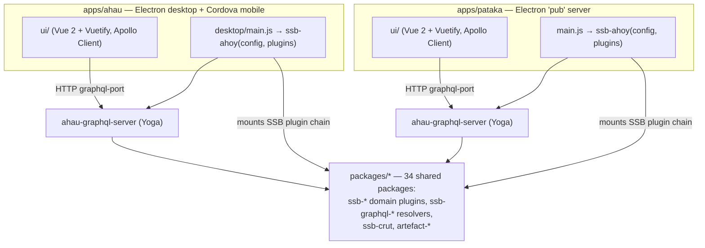
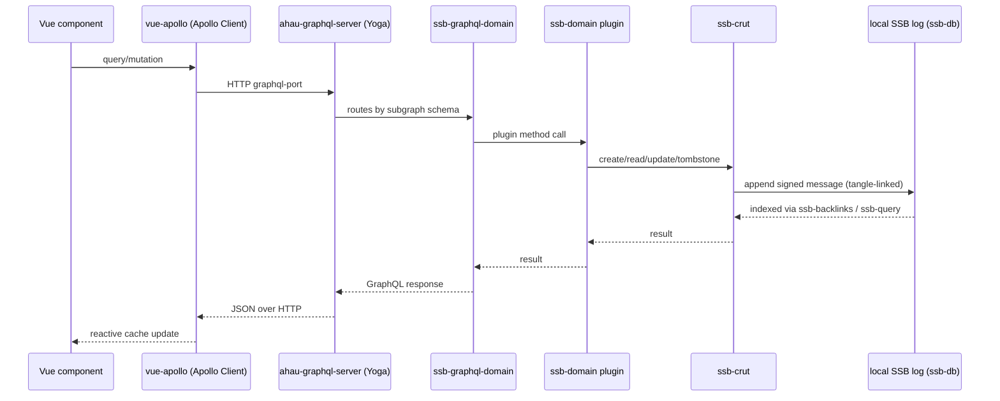

# Āhau System Architecture

This document maps how the code in this org fits together **after its 2026-08-19
migration from 61 separate repositories into a single npm-workspaces monorepo**
(see `docs/adr/0001-consolidate-plugin-ecosystem-into-monorepo.md` in the monorepo
itself). It's built from a fresh codemap scan of the monorepo (1,035 files, captured
2026-08-21) rather than from the old per-repo GitLab history, so it describes what the
code does today, not how actively each piece was historically maintained as a
standalone repo. It's written for someone who knows general software engineering but
has never touched Secure Scuttlebutt (SSB) or this codebase before.

See the [Appendix](#appendix-how-this-map-was-built-how-to-regenerate-it) for how to
regenerate or extend this analysis.

---

## 1. What is Secure Scuttlebutt, in this codebase's terms

SSB is a peer-to-peer protocol with no servers and no central database. The concepts
that actually matter for reading this code:

- **Feed** — each person/device identity is an append-only, cryptographically signed
  log of messages (like a personal git log). `ssb-db` is the local store for feeds
  this device knows about.
- **Replication** — devices exchange feed messages directly with each other
  (`ssb-conn`, `ssb-lan`, `ssb-replicate`, `ssb-friends`) whenever they connect, over
  the internet or a local network with no internet at all. There is nothing to deploy
  or host centrally for the core protocol to work.
- **Mutation without UPDATE/DELETE** — you can't edit or remove a message once
  published. Instead, `ssb-crut` (this codebase's own framework) models
  Create/Read/Update/**Tombstone** as new messages linked into a `tangle`, and reads
  are indexed via `ssb-backlinks`/`ssb-query` rather than looked up by primary key.
- **`recps` (recipients)** — a message can list who's allowed to read it; `ssb-tribes`
  handles the group-encryption side, and `ssb-recps-guard` (an internal package here)
  enforces the boundary at read/write time across every plugin.
- **Blobs** — large content (files, photos) is stored content-addressed and served
  separately from the log itself (`ssb-blobs`/`ssb-serve-blobs` for small files,
  `ssb-hyper-blobs` + `artefact-store`/`artefact-server` here for larger/streamed
  ones).

None of the above is vendored into this repo — `ssb-db`, `ssb-query`, `ssb-backlinks`,
`ssb-conn`, `ssb-lan`, `ssb-replicate`, `ssb-friends`, `ssb-blobs`, `ssb-serve-blobs`,
`ssb-invite`, `ssb-tribes`, and `secret-stack` (the plugin-loading framework
underneath `ssb-server`) all stay external, ordinary npm dependencies. This map only
covers what actually lives in this monorepo: two apps and ~34 shared packages.

## 2. System at a glance



Both apps are thin shells: an Electron main process that boots an `ssb-server` with a
plugin list, plus a Vue 2 SPA that talks to that server's own local GraphQL endpoint.
Almost everything either app *does* lives in the shared `packages/*` workspace, not in
`apps/*` itself.

### Service boundaries

- **`apps/ahau`** — the family-tree ("whakapapa") client. Sub-workspaces: `desktop`
  (Electron main process), `ui` (Vue 2 SPA, also built for a Cordova `mobile` shell —
  `mobile` deliberately isn't an npm workspace member; it has its own lockfile).
- **`apps/pataka`** — a "pub"/hosting node that keeps a tribe's backups and
  replication running even when personal devices are offline; own Electron `main.js` +
  `ui`.
- **`packages/ssb-*`** — SSB-server plugins: log-level read/write logic per domain
  (profile, story, artefact, whakapapa, submissions, settings, tribes-registration),
  plus generic plumbing (crut, crut-authors, hyper-blobs, split-publish, migrate,
  keyring, recps-guard).
- **`packages/ssb-graphql-*`** — GraphQL typeDefs and resolvers per domain, each
  wrapping the matching `ssb-*` plugin.
- **`packages/ahau-graphql-server`** — the generic Express + GraphQL-Yoga host; both
  apps' composition-root plugins hand it their combined subgraph schemas.
- **`packages/ahau-graphql-client`** — shared Apollo Client factory used by both `ui`s.
- **`packages/artefact-store` / `artefact-server`** — hyperdrive-based encrypted blob
  storage and its HTTP server, used by `ssb-artefact`.

## 3. Data flow, per request



Writes go through `ssb-crut`'s CRUT pattern onto `tangle`-based messages; reads are
indexed via `ssb-backlinks`/`ssb-query` rather than queried directly off the log.
Private data carries a `recps` list and, for group-level privacy, `ssb-tribes`
encryption — `ssb-recps-guard`, mounted last in both apps' plugin chains, is what
actually enforces that boundary on every read and write.

Nothing here waits on a remote server: once the request reaches the local
`ahau-graphql-server`, everything downstream is on-device. New data reaches other
people's devices later, asynchronously, through SSB replication — not as part of
this request/response cycle.

## 4. Domain SSB plugins

The plugins that know what a family tree, profile, or story actually *is*, mounted
(in this order) alongside generic plumbing when each app's `ssb-server` starts:

```
ssb-db → ssb-query → ssb-backlinks → ssb-conn → ssb-lan → ssb-replicate → ssb-friends
  → ssb-blobs → ssb-serve-blobs → ssb-hyper-blobs → ssb-invite
  → [ahau only: ssb-tribes, ssb-tribes-registration]
  → ssb-profile → ssb-settings → ssb-story → ssb-artefact → ssb-whakapapa → ssb-submissions
  → [ahau: ssb-ahau, ssb-atala-prism] / [pataka: ssb-pataka]
  → ssb-recps-guard
```

| Plugin | What it owns |
|---|---|
| `ssb-profile` | Person/tribe profile records — names, avatars, identity |
| `ssb-story` | Written/audio/photo narratives attached to people, places, events |
| `ssb-artefact` | Files and photos, backed by `ssb-hyper-blobs`/`artefact-store` |
| `ssb-whakapapa` | Relationship links — the actual genealogy graph |
| `ssb-submissions` | Content submitted for review before publishing to a tribe |
| `ssb-settings` | Per-tribe and per-person settings |
| `ssb-tribes-registration` | Request-to-join flow for private tribes — **ahau only** |
| `ssb-pataka` | Pātaka-specific record types + composition root — **pataka only** |
| `ssb-ahau` | Composition root: wires every domain resolver into one schema for ahau |
| `ssb-atala-prism` | Digital-wallet/credential SDK wrapper — **ahau only**, currently broken (see §7) |

`ssb-ahau` and `ssb-pataka` aren't content plugins themselves — they're each app's
composition root, importing every `ssb-graphql-*` resolver package for that app's
domain and handing the combined schema to `ahau-graphql-server`.

### `packages/ssb-pataka/ui` is not a duplicate of `apps/pataka/ui`

Despite sharing several component names, `packages/ssb-pataka/ui` is a distinct,
purpose-built public app: a "web registration form" (`RegistrationIndex`,
`RegistrationNew`, `RegistrationForm`, `RegistrationSuccess`), served as static files
by `packages/ssb-pataka/plugins/web-registration.js` when
`config.pataka.webRegistration` is set. `apps/pataka/ui` is the separate admin
dashboard. Confirmed live during the codemap scan, not dead code.

## 5. GraphQL layer

| Domain | GraphQL package |
|---|---|
| profile | `ssb-graphql-profile` |
| story | `ssb-graphql-story` |
| artefact | `ssb-graphql-artefact` |
| whakapapa | `ssb-graphql-whakapapa` (uses the `graphql-edtf` scalar for uncertain dates) |
| submissions | `ssb-graphql-submissions` |
| settings | `ssb-graphql-settings` |
| invites | `ssb-graphql-invite` |
| tribes (private groups) | `ssb-graphql-tribes` — **ahau only** |
| pataka-specific | `ssb-graphql-pataka` — **pataka only** |
| stats | `graphql-stats` |
| root/main schema | `ssb-graphql-main` — also owns `loadContext` |

`packages/ahau-graphql-server` is the one generic host: Express + `graphql-yoga`,
mounted at `/graphql`, with `graphql-upload` middleware (5MB / 10-file cap) and a
schema built via `@apollo/subgraph.buildSubgraphSchema(schemas)`. CORS is
origin-checked against `allowedOrigins`, the GraphiQL origin, and the dev-server
origin, and is strict in production. `packages/ahau-graphql-client` is the matching
shared Apollo Client factory both `ui`s' `plugins/vue-apollo.js` build on.

## 6. Core data & storage layer

Content-agnostic building blocks with no knowledge of whakapapa, profiles, or any
domain concept — would be reusable in an unrelated SSB app.

- **`ssb-crut`** — the generic CRUT (Create/Read/Update/Tombstone) framework every
  domain plugin builds its record type on. A spec is declared as
  `{ type: '<domain>', props: { field: TangleStrategy } }`, where a `TangleStrategy`
  (from `@tangle/*`, e.g. `Overwrite()`, `SimpleSet()`) defines how concurrent edits
  to that field merge:

  ```js
  const spec = {
    type: 'gathering',
    props: { title: Overwrite(), description: Overwrite(), attendees: SimpleSet() }
  }
  const crut = new Crut(ssb, spec)
  crut.create({ title: '...', recps: ['%groupId.cloaked'] }, (err, id) => {})
  ```

- **`ssb-crut-authors`** — the same pattern with author/permission checks baked in,
  for record types that need author-scoped write access.
- **`artefact-store`** + **`artefact-server`** — hyperdrive-based encrypted, streamed
  storage for larger artefact files, and the HTTP server that serves it.
- **`ssb-hyper-blobs`** — hyperdrive blob plugin, local HTTP serving, sits on top of
  `artefact-store`.
- **`ssb-split-publish`** — splits oversized content across multiple SSB messages so
  it fits the log's per-message size limits.
- **`ssb-migrate`** — runs log-format/plugin-version migrations against a user's
  existing SSB database at startup.
- **`ssb-keyring`** — manages the feed keypair(s) per device.
- **`ssb-recps-guard`** — mounted last in both plugin chains; the actual enforcement
  point for `recps`-based privacy across every plugin above it.

## 7. Dependencies and known risks

- **`@atala/apollo` / `@atala/prism-wallet-sdk`** (via `ssb-atala-prism`, ahau-only) —
  pinned to `1.2.10` in the root `package.json` `overrides` to fix a "GraphQL server
  never starting" bug (commit `a4f53d26c`). The pin fixed server startup, but the
  wallet SDK integration itself is still broken — see the gap below.
- **`apps/ahau/desktop` pins `ssb-ahau@^16.4.1`** (stale) instead of the migrated
  `17.0.0` workspace package, because there's no test suite there yet to safely
  verify a bump. This is what makes `npm run dev:ahau` crash at launch, via
  `ssb-atala-prism` → `@atala/prism-wallet-sdk`.
- **Vue version drift** — `^2.6`–`^2.7` across packages/apps, not yet unified.
- **`edtf` pinned to exact `4.4.2`** in `apps/ahau/ui` (not a range) because newer
  versions' syntax breaks under Vite — fragile if bumped without re-verifying.
- **No CI/CD yet.** This is a proof-of-concept migration, validated so far via local
  `npm test` per package plus bundler-only builds for the two apps.
  `apps/*/bundle.mjs` (esbuild) produces `main.bundle.js` for Electron;
  `apps/ahau/scripts/ci-*.sh` exist but aren't wired into any actual CI.
- A Playwright E2E scaffold (`apps/ahau/ui/e2e/login.spec.js`, one login smoke test)
  was added 2026-08-21 — the first end-to-end test coverage in the monorepo.

## 8. Notable findings for whoever inherits this

1. **The plugin-per-domain shape survived the monorepo migration intact.** This isn't
   a rewrite — 61 repos were consolidated into workspaces with their existing
   boundaries preserved, which is why the dependency shape here still reads like a
   microservices diagram even though it now all ships as two Electron binaries.
2. **`ssb-pataka/ui` looking like a duplicate is a trap** — see §4. Don't delete it or
   "de-duplicate" it against `apps/pataka/ui` without checking
   `web-registration.js` first.
3. **The `ssb-ahau@^16.4.1` pin is the single most impactful known issue** — it's the
   direct cause of the current `dev:ahau` startup crash, and unblocking it needs a
   test suite for `apps/ahau/desktop` that doesn't exist yet.
4. **There's no dead code or spec-only content left as separate tracked units** in
   this monorepo the way there was across the old 61-repo org (prototypes, spikes,
   and written specs from that era weren't carried into the workspace consolidation).
   Everything under `packages/*` and `apps/*` here is live, imported code.

## Appendix: how this map was built / how to regenerate it

This document, `PLAIN-SUMMARY.md`, and the interactive views in `index.html` /
`graph.html` are derived from a codemap scan of the Āhau monorepo — `codemaps/*.md`
(architecture, backend, frontend, data, dependencies), generated 2026-08-21 by
scanning 1,035 files. To regenerate: re-run the codemap scan against a fresh checkout
of the monorepo, drop the updated `.md` files into `codemaps/`, and update this
document plus `index.html`/`graph.html`'s embedded data to match. `README.md` in this
repo's root explains the "Learn more" README workflow (`readmes/` +
`scripts/sync-readmes.js`) for the per-package detail pages.
